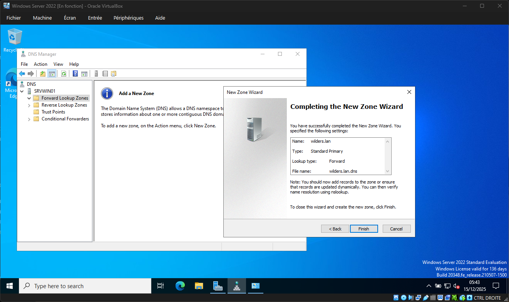
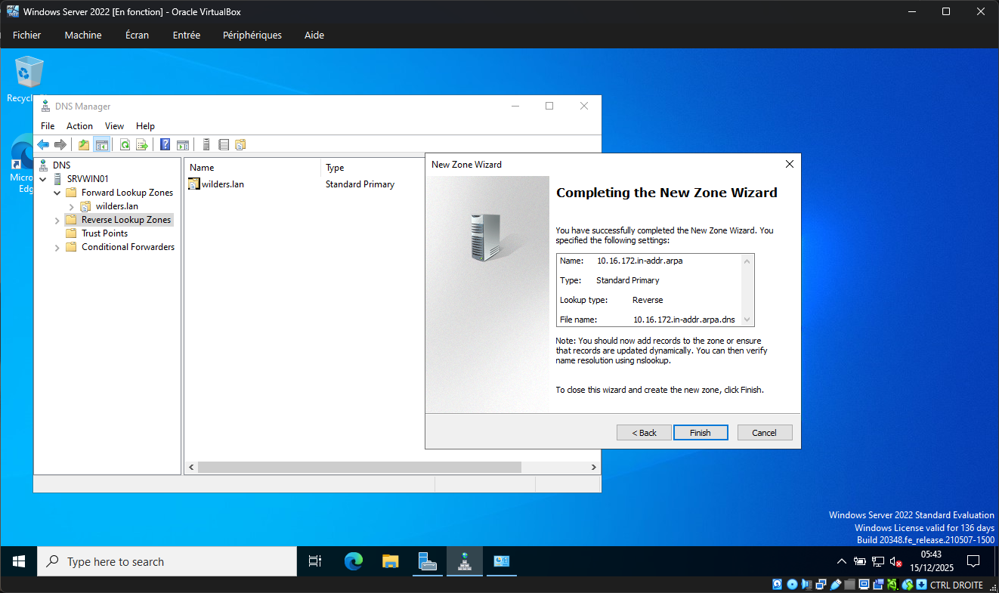
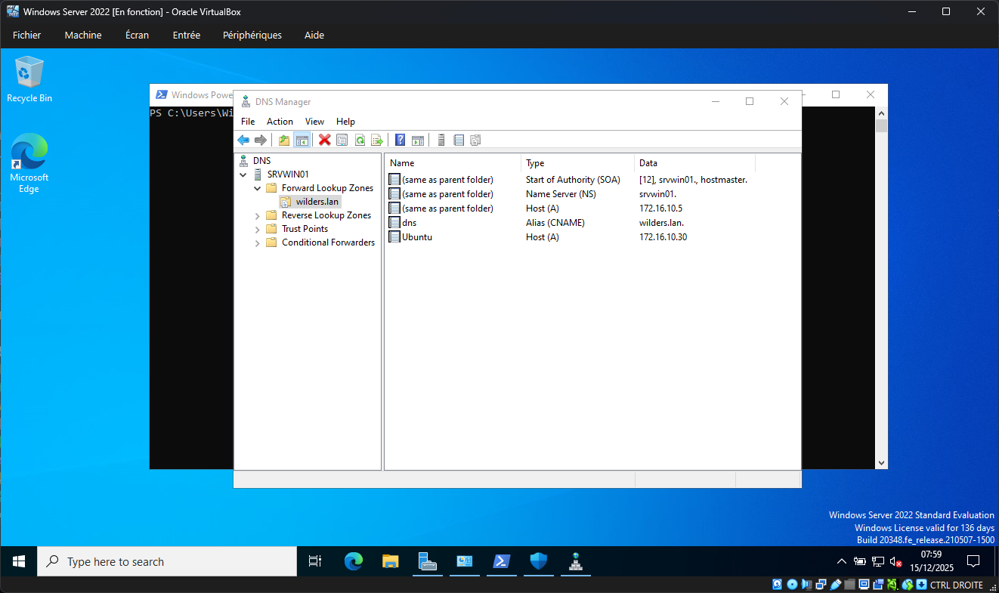
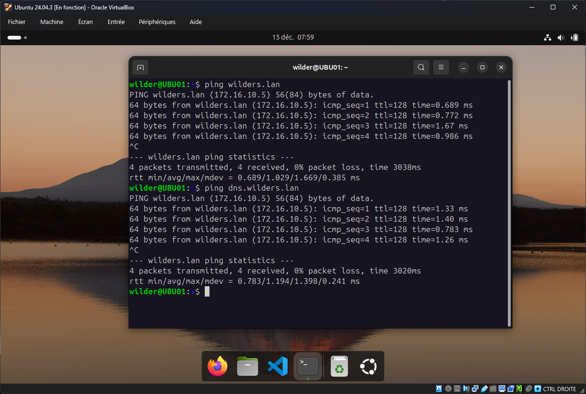
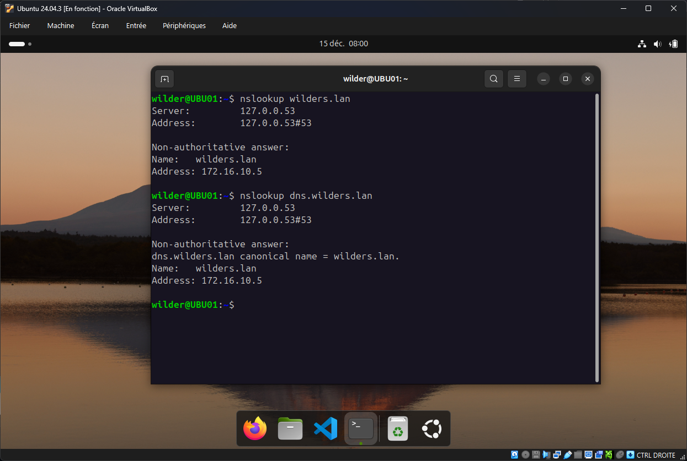

# DNS-avec-Windows-Server

## 1. La configuration de la zone directe du serveur

Configuration de la Forward Lookup Zone " wilders.lan "

---

## 2. La configuration de la zone indirecte du serveur

Configuration de la Reverse Lookup Zone " **172.16.10** " qui s'écrit " **10.16.172.in-addr-arpa** "

---

## 3. La configuration des Hosts A et des alias CNAME

Configuration des Hosts suivants :
- " " = same as folder parent (pour garder le même nom que la Forward Lookup Zone : wilders.lan avec l'adresse du serveur Windows 172.16.10.5
- dns (CNAME) qui correspond à l'alias de " wilders.lan " 
- Ubuntu (Host A) avec l'adresse 172.16.10.30 qui correspond au client Ubuntu 24.04 LTS

---

## 4. Un ping depuis le client vers les 2 noms DNS du serveur

Un ping vers " wilders.lan " et son alias " dns.wilders.lan " .

---

## 5. le résultat de la commande **nslookup** depuis le client vers le serveur DNS

La commande nslookup pour les deux noms DNS " wilders.lan " et son alias " dns.wilders.lan
